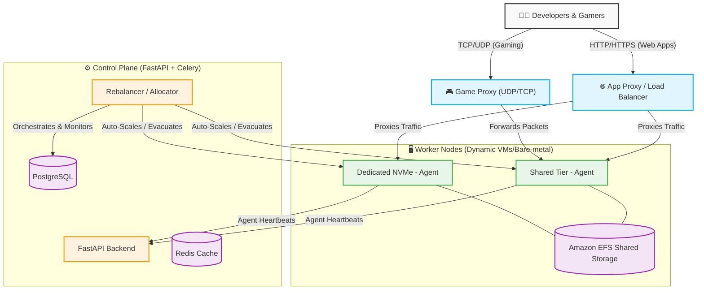

# Blockhost: The Next-Gen Platform as a Service (PaaS)

Blockhost is a modern, highly scalable platform designed to host **Docker Web Apps, Databases, and Minecraft Servers** on an optimized fleet of bare-metal and cloud instances. It brings Heroku-like simplicity to developers while maintaining the extreme resource efficiency and auto-sleeping capabilities required for massive scale gaming.

---

## 🏗️ High-Level Architecture

The system is completely decoupled into three scalable layers:

---

## 🚀 Key Features

### 1. Unified PaaS for Apps & Gaming
Deploy anything instantly. Whether it's a **Next.js frontend, a Python FastAPI backend, a PostgreSQL Database, or a PaperMC server**, Blockhost handles the provisioning. 
- **Sticky Deployments:** Web apps are treated as mission-critical workloads. They run 24/7 with 100% stickiness to their node for maximum uptime.
- **Disposable Gaming:** Minecraft servers are treated as ephemeral. The orchestrator dynamically shuffles them between nodes in the background to pack servers tightly and optimize costs.

### 2. The Tier System (Shared vs Dedicated)
- **Shared Tier:** Cost-efficient nodes designed for hobby projects, basic static sites, and small gaming groups.
- **Dedicated Tier:** High-performance nodes equipped with NVMe drives and dedicated CPU threads for production databases and high-traffic applications.

### 3. Persistent EFS Storage & Automated Quotas
Every deployment automatically receives a secure, persistent storage volume mounted via Amazon EFS (or local NFS equivalents). 
- If a Node crashes, the Control Plane instantly reassigns the deployment to a healthy Node, which seamlessly remounts the exact same EFS volume.
- **Automated Quotas:** The Agent actively monitors disk usage (`du`). If a user exceeds their database storage limit (e.g., 5GB), the Agent halts their container and flags a `quota_exceeded` status.

### 4. Scale-to-Zero & Infrastructure Autoscaling
Blockhost minimizes cloud provider costs intelligently:
- **Node Overflow:** If a node reaches 85% Active RAM, the Rebalancer automatically halts new deployments to that server. If no servers are available, the Control Plane hits your Cloud Provider API to boot up a fresh bare-metal node.
- **Auto-Shutdown:** If all Minecraft servers are asleep and zero Web Apps are running on a specific node, the Rebalancer evacuates any suspended data and completely terminates the underlying EC2/VPS instance to save money.

---

## 🧩 Core Components

### 1. The Control Plane
The brains of the operation, written in **Python (FastAPI)** and backed by **PostgreSQL**. It serves the web dashboard, processes agent heartbeats, provisions Node infrastructure, and executes complex background rebalancing loops.

### 2. The Agent Worker (`blockhost-agent`)
A lightweight `systemd` Python daemon running on every worker node. It translates Control Plane commands into direct Docker Engine and host OS operations (e.g., pulling images, configuring memory constraints, tracking Minecraft log states, and enforcing disk quotas).

### 3. The Client UI
A beautiful, highly interactive cross-platform dashboard built with **Flutter**. Users can view live server logs, manage their custom domains (`url_launcher` integrated), view memory charts, and deploy apps with a single click.
