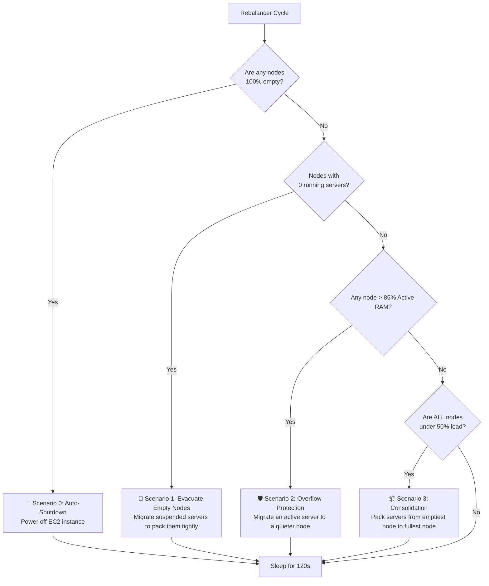

# BlockHost Architecture

BlockHost is a modern, distributed Minecraft hosting service designed for extreme scalability, dynamic load balancing, and cost efficiency. It orchestrates a fleet of bare-metal or cloud instances (EC2), dynamically routing player traffic and shuffling Minecraft servers in the background to pack servers tightly and shut down idle hardware.

---

## 🏗️ High-Level Architecture

The system is split into three primary layers, completely decoupled from one another:

```mermaid
graph TD
    %% Define Styles
    classDef client fill:#f9f9f9,stroke:#333,stroke-width:2px;
    classDef proxy fill:#e1f5fe,stroke:#03a9f4,stroke-width:2px;
    classDef control fill:#fff3e0,stroke:#ff9800,stroke-width:2px;
    classDef node fill:#e8f5e9,stroke:#4caf50,stroke-width:2px;
    classDef db fill:#f3e5f5,stroke:#9c27b0,stroke-width:2px;

    %% Nodes
    Player[🎮 Players (Minecraft Client)]:::client
    Proxy[🚀 Game Proxy (Dedicated EC2)]:::proxy
    
    subgraph Control Plane [⚙️ Control Plane (Docker Stack)]
        API[FastAPI Backend]:::control
        Worker[Background Worker / Rebalancer]:::control
        DB[(PostgreSQL)]:::db
        Redis[(Redis Cache/Lock)]:::db
    end

    subgraph Agent Fleet [🖥️ Worker Nodes (Dynamic EC2s)]
        NodeA[Node A - Systemd Agent]:::node
        NodeB[Node B - Systemd Agent]:::node
    end
    
    S3[(Amazon S3 World Backups)]:::db

    %% Connections
    Player -- "TCP/UDP via Stable Proxy Port" --> Proxy
    Proxy -- "Reads Routing Table" --> DB
    Proxy -- "Forwards Packets" --> NodeA
    Proxy -- "Forwards Packets" --> NodeB
    
    NodeA -- "Heartbeats (IP/Stats)" --> API
    NodeB -- "Heartbeats (IP/Stats)" --> API
    
    Worker -- "Orchestrates & Monitors" --> DB
    Worker -- "Triggers Migrations" --> NodeA
    Worker -- "Triggers Migrations" --> NodeB
    
    NodeA -- "Uploads/Downloads Worlds" --> S3
    NodeB -- "Uploads/Downloads Worlds" --> S3
    
    API --- DB
    API --- Redis
    Worker --- DB
```

---

## 🧩 Core Components

### 1. The Game Proxy (The Traffic Cop)
Players never connect directly to the underlying worker nodes. Every server is assigned a static `proxy_port` (e.g., `30001`). 
- The Game Proxy runs on a dedicated, lightweight VM (e.g., `t3.nano`) using **Host Networking** for ultra-fast RakNet (Bedrock) UDP routing.
- It constantly polls the Postgres database for routing updates.
- If a server is migrated to a new EC2 instance, the Proxy hot-swaps the route in memory. The very next packet is forwarded to the new IP address—**seamlessly, with zero downtime or proxy restarts.**

### 2. The Control Plane
The brains of the operation. It runs as a Docker Compose stack containing:
- **FastAPI Backend:** Serves the frontend web app, handles user requests, and receives agent heartbeats.
- **Postgres Database:** The ultimate source of truth. Stores node states, server billing plans, and the active network routing table.
- **Background Worker:** A dedicated process that runs the Node Rebalancer, Disk Health Monitors, and Backup Schedulers.

### 3. The Agent Nodes (Worker Fleet)
The physical machines (e.g., EC2 instances) that actually run the Minecraft worlds.
- The `blockhost-agent` runs as a native Linux `systemd` service.
- When an EC2 boots, Linux automatically starts the agent, which immediately sends an HTTP heartbeat to the Control Plane saying *"I'm online!"*.
- **Resource Limits:** The agent dynamically creates `systemd` slices (`MemoryMax=`) for each server based on the user's billing plan. If a server attempts to use more RAM than it paid for, the Linux kernel forcefully restricts it via OOM (Out Of Memory) limits, preventing noisy neighbors from crashing the node.

---

## ⚖️ The Node Rebalancer (Auto-Scaling & Load Balancing)

To minimize AWS EC2 costs, the Background Worker runs a highly intelligent **Rebalancer** every 120 seconds. It evaluates the network and executes one of four scenarios:



### 1. Evacuate Empty Nodes & Overselling
If a node has **0 running servers** but still holds suspended server files, the Rebalancer flags it for evacuation. It migrates one suspended server off the node every 2 minutes. **Crucially, it bypasses RAM capacity limits on the target node during this phase,** allowing the system to tightly pack hundreds of suspended servers onto a single machine.

### 2. Auto-Shutdown
Once the evacuation phase finishes and a node has **0 running AND 0 suspended servers**, the Rebalancer talks to the Cloud Provider API (AWS) and shuts off the physical machine to save money. If all servers in the network are suspended, the system will scale down to **exactly 1 node** and stay there.

### 3. Overflow Protection (Active RAM)
When a user clicks "Start", the system only checks **Active RAM** (the RAM used by currently running servers). If starting a server pushes a node's Active RAM too high, the Rebalancer will instantly kick in and shed load by migrating a running server to a quieter node. 

---

## 💤 The Overselling Architecture (Auto-Sleep & Wake-on-Connect)

To maintain extreme profitability, BlockHost utilizes a sophisticated "Overselling" and caching architecture. By safely overselling RAM at a 10:1 ratio, a single EC2 instance can host hundreds of paying users seamlessly.

### 1. Heartbeat Player Tracking
The Agent (`blockhost-agent`) continuously monitors the systemd `journalctl` logs of all running Minecraft servers to track exactly how many players are online in real-time. This player count is bundled into the Agent's 5-second WebSocket heartbeat. This eliminates the need for the Control Plane to spam the network with hundreds of RakNet pings.

### 2. The Auto-Sleeper (NVMe Hot Cache)
A background worker continuously scans the database. If a server has `0` players online for **15 minutes**, it is marked as `suspended`. 
- The Agent performs a graceful local `systemctl stop`.
- **Crucially: The world files are NOT uploaded to S3.** They remain on the local NVMe drive. 
- This acts as a high-speed "Hot Cache". If the player returns a few hours later, the server boots locally in under 20 seconds.

### 3. Wake-on-Connect (The Proxy Magic)
The Game Proxy intercepts connections for `suspended` servers and triggers a Wake API call, allowing players to start their server just by trying to join it in Minecraft:
- **For Java (TCP):** The Proxy uses the **"Drop and Retry"** method. It hits the Wake API and immediately drops the TCP connection. The player's client shows "Connection Refused" and forces them to click retry, buying the node 15-20 seconds to boot the server in the background.
- **For Bedrock (UDP):** The Proxy intercepts the Unconnected Ping and returns a spoofed RakNet Pong (`Server Waking Up... (0/0 players)`). The player's server list stays online and stalls while the server boots.

### 4. Rebalancer Garbage Collection (S3 Cold Storage)
If *every* server on a node goes to sleep (e.g., at 4:00 AM), the node's Active RAM drops to 0%. The Node Rebalancer's **Consolidation** cycle will detect this totally idle node. It will migrate the sleeping servers to a busier node, **uploading them to Amazon S3 Cold Storage** in the process, and finally shut down the empty EC2 instance entirely.
